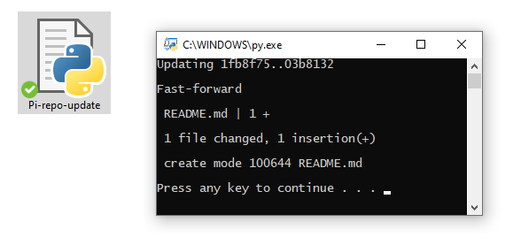
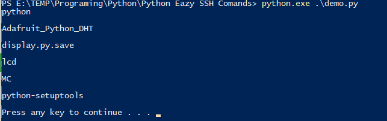

## About ezssh
This simple code will allow you to execute comand on your machine trough ssh using python.
I created this one cause it took me a a lot of time before i found solution.
I cudn't find eazy and simple way to execute ssh comand.
Everything is based on paramiko libray.

## How to install
1. pip install -r requirements.txt
2. See demo file.

## How to use
```
host="Your HOST IP adress"
port=22
username="Your_username"
password="Your_password"

ssh = ezssh(host,port,username,password)
```

```
#for one command
ssh.command("Your_command")
```

```
#for multiple comands
ssh.command("Your_command; Your_next_comand; Your_another_command")
```

```
#Sending shutdown comand to ssh
ssh.shutown()
```

```
#Sending reboot comand to ssh
ssh.reboot()
```

## Photos
<p align="center">
    
</p>
<p align="center">
    
</p>
